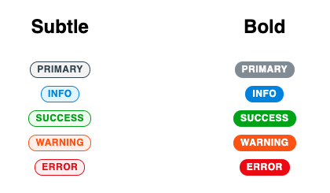

# React Label [](https://travis-ci.org/mturnwall/react-label-component)

Label is a contextual text label built in React. It should primarily be used to display just one or two words.

[Demo](https://react-label.netlify.app/)



## Props

| Name       | Description                                                          | Type                                                       | Default   |
| ---------- | -------------------------------------------------------------------- | ---------------------------------------------------------- | --------- |
| as         | Determines the HTML element used to render the Lozenge               | `string`                                                   | 'span'    |
| children\* | The inner part of the Lozenge, generally just a string               | `node`                                                     | -         |
| color      | The primary color scheme of the Lozenge                              | `'primary' \| 'info' \| 'success' \| 'warning' \| 'error'` | 'primary' |
| theme      | Use this to pass in a theme. It will override any global theme       | `object`                                                   | -         |
| type       | Determines if the Lozenge has transparency (subtle) or filled (bold) | `'bold' \| 'subtle'`                                       | 'subtle'  |

<span style="font-size: 10px;">\*required prop</span>

## Examples

```jsx
<Label>Primary</Label>
<Label color="info">Info</Label>
<Label color="success">Success</Label>
<Label color="warning" type="bold">Warning</Label>
```

## Theming

A label has no styling applied to it by default. All styling is done through supplying a theme object, either globally or by using the `theme` prop. The preferred method is a global theme which can be provided using the `ThemeProvider` wrapper from `styled-components`.

The theme object should have a key named `label` and at the bare minimum have a key named `base`. If you don't want to use one of allowed `color` or `type` simply leave it out of the theme object.

Each `color` object should be

```javascript
[color]: {
    [type]: {
        [style]: ''
    },
},
```

The allowed styles you can customize per `color -> type` are:

-   `background-color`
-   `border-color`
-   `color`

For `background-color` and `border-color` you need to leave off the `-color` portion. It's assumed that you are just setting a color so the key leaves off that part.

### Theme Examples

#### Full Theme

```javascript
const label = {
    base: {},
    preview: {
        subtle: {
            background: '',
            border: '',
            color: '',
        },
        bold: {},
    },
    info: {
        subtle: {},
        bold: {},
    },
    success: {
        subtle: {},
        bold: {},
    },
    warning: {
        subtle: {},
        bold: {},
    },
    error: {
        subtle: {},
        bold: {},
    },
};
const theme = {
    label,
};
```

#### Partial Theme

```javascript
const label = {
    base: {},
    preview: {
        subtle: {
            background: '',
            border: '',
            color: '',
        },
        bold: {},
    },
    info: {
        subtle: {},
        bold: {},
    },
};
const theme = {
    label,
};
```
